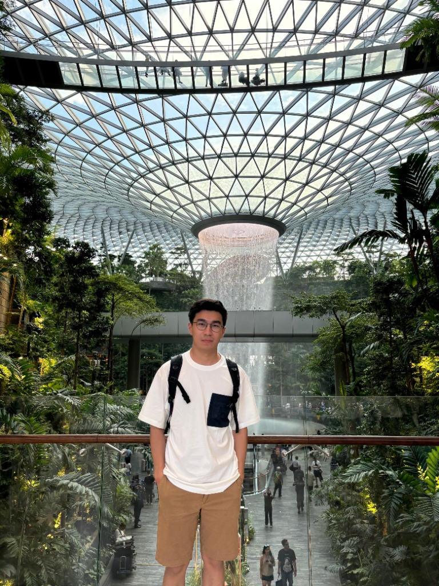

# Clement Portfolio

**Data Science Student | Agentic AI & Full Stack Intelligence**

> "I am a Data Science student at Universitas Bunda Mulia committed to transforming raw data into renewable intelligence. My expertise spans the full stack: analyzing, processing, modeling, and deploying robust AI solutions. With a special focus on 'data recycling' and the emerging field of Agentic AI, I aim to build autonomous systems that deliver clarity and actionable results from complex datasets."

## 🚀 Projects

- **[Ulas.in](https://github.com/Clementcww/Ulas.in)**: Real-time sentiment analysis engine.
- **[International Bandwidth Dashboard](https://github.com/Clementcww/International_Bandwith_Dashboard)**: Monitoring global network traffic.
- **[Email Spam Detection](https://github.com/Clementcww/Email_Spam)**: ML-powered classification.
- **[NYC Yellow Taxi Analytics](https://github.com/Clementcww/NYC_Yellow_Taxi)**: Urban transport optimization.
- **[NLP Topic Modeler](https://github.com/Clementcww/Indonesia_News)**: Corpus analysis pipeline.

## 🛠️ Tech Stack

- **Framework**: Next.js 16
- **Styling**: Tailwind CSS v4
- **Deploy**: Vercel
